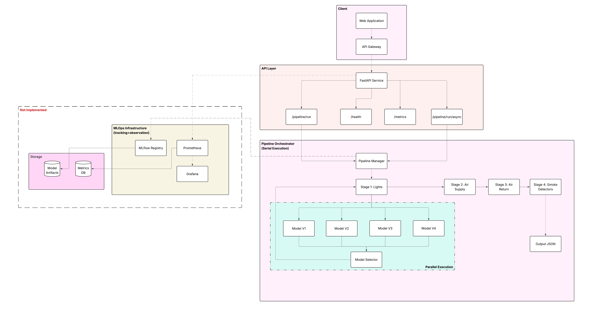
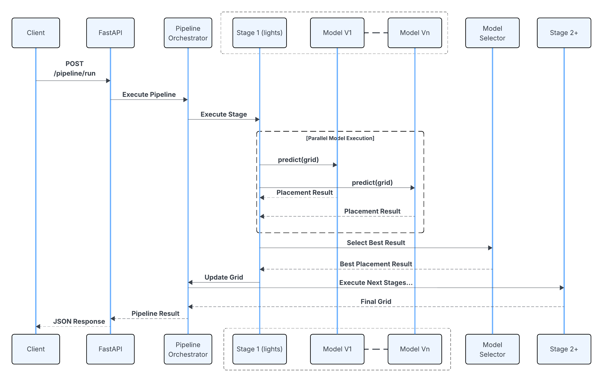
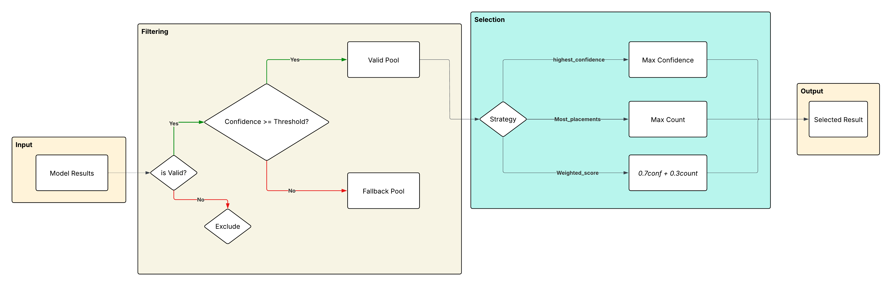
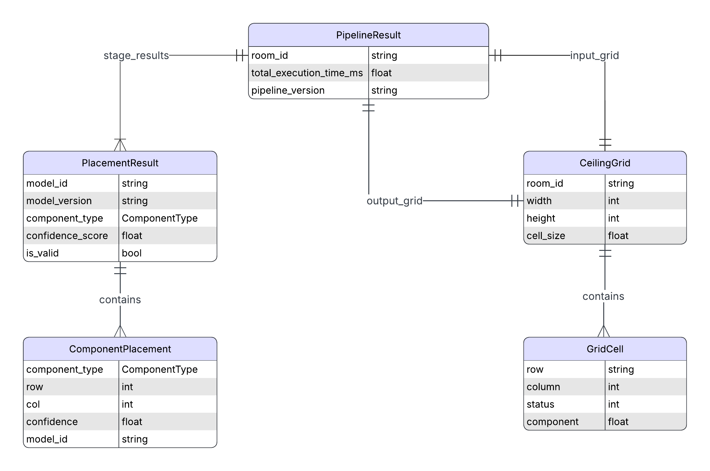

# Ceiling ML Pipeline

A modular MLOps pipeline for automated ceiling component placement using multiple ML models. The pipeline supports lights, air supply/return vents, and smoke detectors with competing models and automatic selection based on confidence scores/number of placements.

## Features

- **Multi-model competition**: Multiple models compete for the same task, best one is selected (Parallel execution)
- **Sequential pipeline stages**: Components placed in order (lights -> air supply -> air return -> smoke detectors)
- **Pluggable models**: Easy to swap models (mock, scikit-learn K-Means, lightweight LLM via Ollama for demo)
- **REST API**: FastAPI backend with sync/async execution
- **Interactive UI**: Streamlit-based grid editor and visualization
- **Docker support**: Containerized deployment

## Architecture

### System Architecture



### Pipeline Execution Flow


### Model Selection Strategy


### Data Model Relationships



## Models

| Model ID | Type | Description |
|----------|------|-------------|
| `light_placement_v1` | Mock | Grid-based placement |
| `light_placement_v2` | Mock | Offset grid pattern |
| `light_placement_v3` | K-Means | scikit-learn clustering |
| `light_placement_v4` | LLM | Ollama (qwen2.5:0.5b) |
| `air_supply_v1` | Mock | Spacing-based placement |
| `air_return_v1` | Mock | Edge placement |
| `smoke_detector_v1` | Mock | Coverage-based placement |

## Setup

### Prerequisites

- Python 3.12+
- Ollama (for LLM model)

### Installation

```bash
# Clone repository
git clone https://github.com/vmc99/mlops-pipeline.git
cd mlops-pipeline

# Create virtual environment
python -m venv venv
source venv/bin/activate  # On Windows: venv\Scripts\activate

# Install dependencies
pip install -r requirements.txt
```

### Setup Ollama (for LLM model)

```bash
# Install Ollama
brew install ollama  # macOS

# Start Ollama server
ollama serve

# Pull the model
ollama pull qwen2.5:0.5b
```

## Running the Application

### Option 1: Run Locally

```bash
# Terminal 1: Start FastAPI backend
python -m uvicorn src.api.main:app --reload

# Terminal 2: Serve Ollama if not running
ollama serve

# Terminal 3: Start Streamlit UI
streamlit run src/ui/app.py
```

Access:
- **API**: http://localhost:8000
- **API Docs**: http://localhost:8000/docs
- **UI**: http://localhost:8501

### Option 2: Run with Docker

```bash
# Build and run
docker-compose up --build

# Or run in background
docker-compose up -d --build

# Stop
docker-compose down
```
Note: For the LLM model (V4), Ollama needs to run on your host machine. The container connects to it via host.docker.internal:11434.


## API Usage

### Run Pipeline (Sync)

```bash
curl -X POST "http://localhost:8000/pipeline/run" \
  -H "Content-Type: application/json" \
  -d '{
    "room_id": "room-123",
    "width": 10,
    "height": 8,
    "matrix": [
      [0, 0, 0, 0, 0, 0, 0, 0, 0, 0],
      [0, 0, 0, 0, 0, 0, 0, 0, 0, 0],
      [0, 0, 1, 1, 0, 0, 1, 1, 0, 0],
      [0, 0, 1, 1, 0, 0, 1, 1, 0, 0],
      [0, 0, 0, 0, 0, 0, 0, 0, 0, 0],
      [0, 0, 0, 0, 0, 0, 0, 0, 0, 0],
      [0, 0, 0, 0, 0, 0, 0, 0, 0, 0],
      [0, 0, 0, 0, 0, 0, 0, 0, 0, 0]
    ]
  }'
```

### Grid Cell Values

| Value | Meaning |
|-------|---------|
| 0 | Valid (empty) |
| 1 | Invalid |
| 2 | Light |
| 3 | Air Supply |
| 4 | Air Return |
| 5 | Smoke Detector |

### Other Endpoints

- `GET /health` - Health check
- `GET /models` - List available models
- `GET /pipeline/stages` - View pipeline configuration
- `POST /pipeline/run/async` - Async execution
- `GET /pipeline/job/{job_id}` - Check async job status

## License

MIT